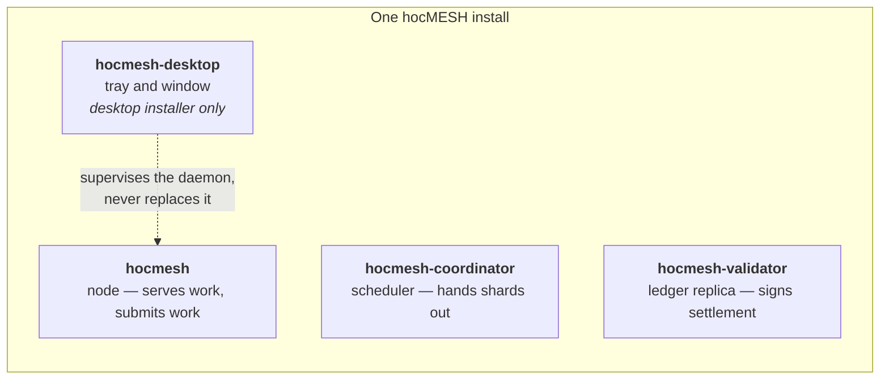
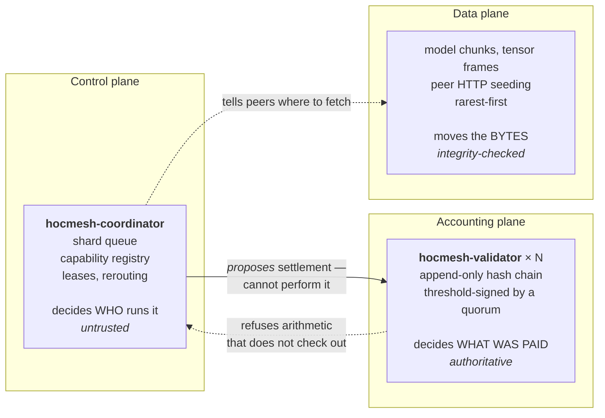
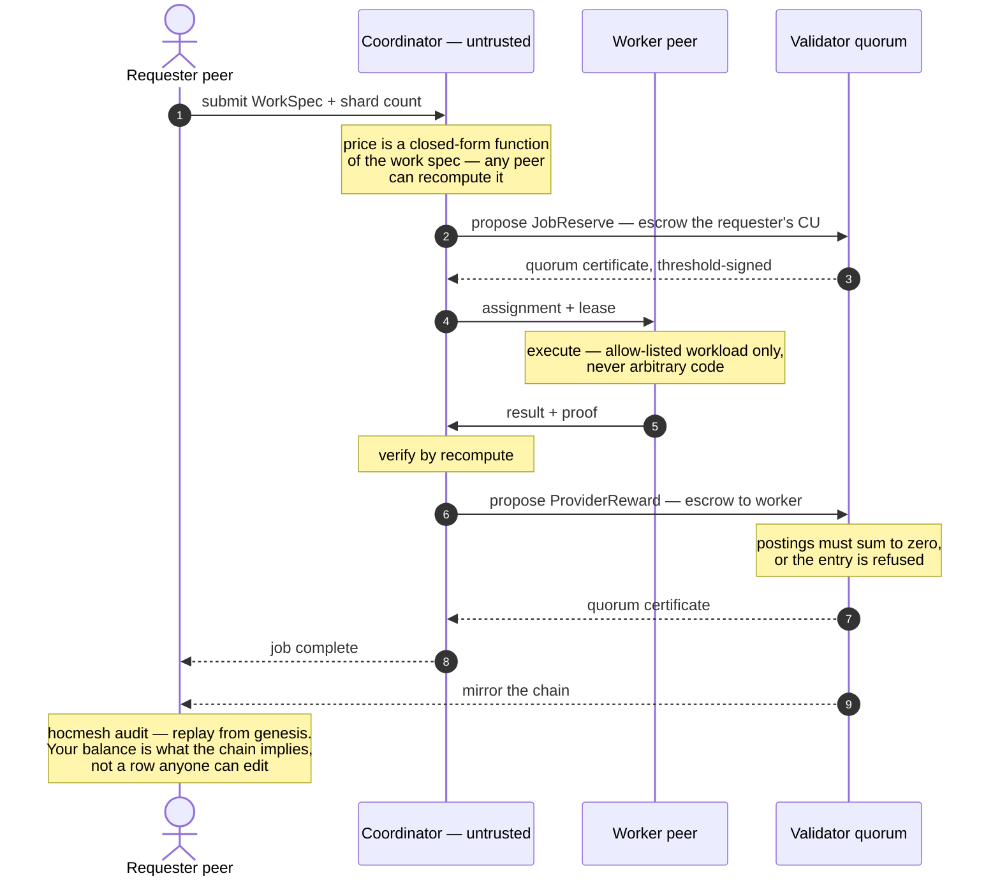
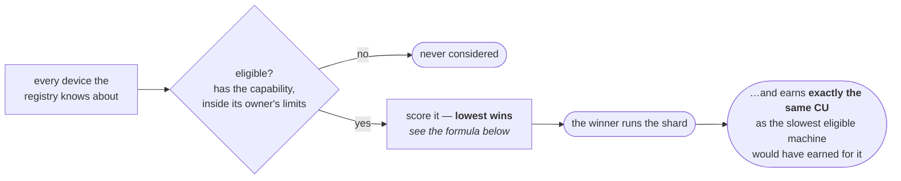
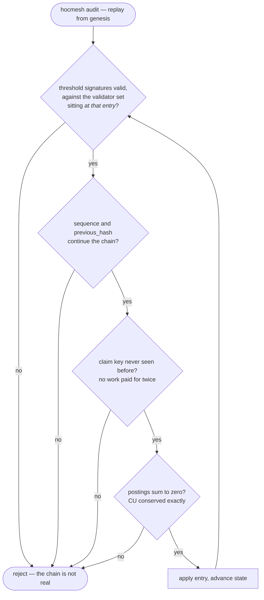
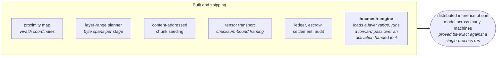
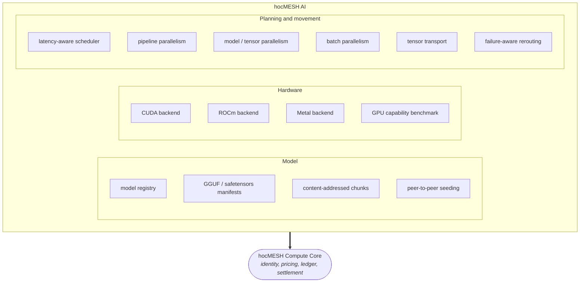
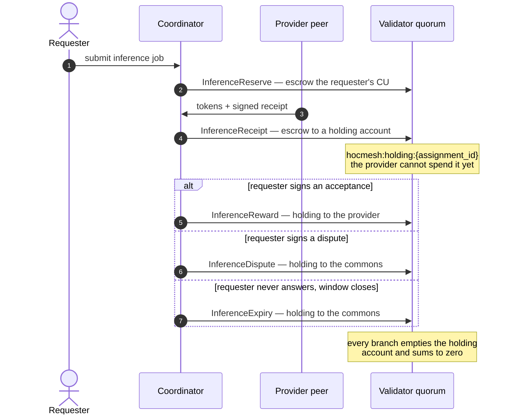

# hocMESH Compute

**hocMESH = Mutual Exchange of Shared Hardware**

hocMESH is a contribution-first distributed compute network with open
participation and closed source. Anyone may join and lend hardware; the
software itself is proprietary and the repository is private. Participants
contribute idle compute, earn non-monetary Compute Units (CU), bank those
units, and later spend them on work executed by other participants.

There is **no payment system, token, cryptocurrency, market, or purchasable credit** in this design.

> Contribute first. Compute later.

This repository is a Rust implementation of hocMESH Compute Core and the hocMESH AI control/data-plane architecture.

## What is implemented in v0.5

This repository contains working source for three native Rust programs:

- `hocmesh` — the peer CLI: it serves hardware and it spends what that earns
- `hocmesh-coordinator` — workload scheduler and node control plane
- `hocmesh-validator` — replicated CU ledger validator

Implemented architecture:

- Ed25519 node identities generated locally.
- Replay-resistant signed API requests using timestamp + cryptographic nonce.
- Hardware discovery and CPU benchmarking.
- Operator-set resource limits: a node advertises the share of CPU/memory/GPU it lends, never the whole machine.
- Measured network coordinates, so the scheduler ranks workers by distance to the requester rather than to itself.
- GPU detection for NVIDIA/CUDA and Apple/Metal-capable systems where detectable by the current hardware adapter.
- Declarative allow-listed work instead of arbitrary remote binaries.
- Deterministic prime-range workload as the first safe distributed workload.
- One-command inference setup: `runtime-install` fetches a llama.cpp build pinned by SHA-256, `model-pull` fetches and verifies GGUF weights. Neither trusts a name.
- Per-layer model addressing: `model-inspect` reads a GGUF tensor directory and reports the byte spans and chunk indexes each pipeline stage would need, so a peer can fetch the layers it will run rather than the whole file.
- **A layer-range execution engine** (`hocmesh-engine`): loads blocks `[start, end)` out of a GGUF file and runs a forward pass over an activation handed to it, on a machine that holds only those layers.
- **Distributed inference of one model across several processes**: `stage-serve` puts a layer range behind a port and forwards to the next stage; `stage-run` drives the chain. Proved bit-identical to running the same model whole, over shards that each hold a minority of the file's bytes.
- `model-shard` materialises the byte range a stage needs as a sparse file, and a stage refuses to start against layers whose bytes are absent — the missing range named in the error, rather than reading holes back as zeros and generating confident nonsense.
- `model-fixture` writes a small but genuine GGUF file, so the split can be exercised without downloading a multi-gigabyte model.
- Multi-worker task parallelism.
- Work leasing and lease expiration/requeue.
- Requesters cannot execute their own paid shards; both scheduler and validators enforce this.
- Contribution-first balance enforcement.
- Local SQLite accounting mode for development.
- **Quorum replicated ledger mode** for the public-network architecture.
- CU-conserving double-entry-style postings.
- Per-job escrow accounts.
- Community bootstrap issuance with a validator-enforced hard cap.
- User job reservation signed by the requester.
- Provider result proofs signed over the exact job, shard, work, reward, funding type, and result.
- Validators independently recompute deterministic work before signing rewards.
- Hash-linked ledger entries.
- Ed25519 quorum certificates.
- Persistent one-vote-per-height validator locks.
- Duplicate reservation/reward claim prevention.
- Full validator ledger replicas in SQLite.
- Validator catch-up/synchronization, and self-healing: a seat that missed a commit fetches what it missed from its peers instead of refusing every entry after it until an operator notices.
- Ordinary peer full-ledger mirroring: any node can hold the whole chain.
- Offline audit from genesis.
- Quorum-signed portable snapshots, so a new replica adopts a verified state and syncs from there rather than replaying the chain from genesis.
- Direct validator balance/head verification independent of the coordinator.
- Crash-safe coordinator ledger intents with startup/manual recovery.
- Coordinator rebuild from the chain, so a lost scheduling database is not a lost job.
- Signed validator claim proofs for reservation/reward reconciliation.
- Per-process ledger proposal serialization to reduce same-height races.
- SQLite-backed network model registry.
- GGUF/safetensors manifests and SHA-256 content-addressed model chunks.
- HTTP peer model seeding with rarest-first multi-peer planning.
- CUDA, ROCm, and Metal discovery and feature-gated llama.cpp adapters.
- Latency/cache/capability-aware AI scheduling and all three parallelism planners.
- Checksum-bound tensor framing, ordered delivery, replay rejection, and route failover.
- Distributed batch inference with leases, results, status, and worker rerouting.
- Scarcity-aware ranking: the smallest machine that fits gets the shard first, without changing what the shard pays.
- Installers for Windows (MSI/NSIS), macOS (dmg/app), Debian (`.deb`), Red Hat (`.rpm`) and AppImage, headless and desktop, each pair replacing the other rather than colliding.

## Runtime boundary

There are two inference paths, and they do different jobs.

**Whole-model batches go through llama.cpp.** `hocmesh runtime-install` fetches a build pinned by SHA-256 for the host platform, so no separate setup is required; `--runtime` accepts a build you compiled yourself, which is the path to CUDA, ROCm or Metal acceleration. This path is fast and it loads whole models, so every machine on it needs to hold the whole model.

**Layer ranges go through `hocmesh-engine`, which is this repository's own.** It loads blocks `[start, end)` out of a GGUF file and runs a forward pass over an activation handed to it, so a machine that holds a third of a model can do a third of the work. It is CPU-only, it is written for correctness rather than speed, and a model that fits on one machine will run faster through llama.cpp. What it buys is the case where nothing fits.

The two do not meet yet: **there is no GPU execution of a single stage.** Accelerated inference means whole models, and split inference means CPU. Closing that is the next substantial piece of work, and `docs/DISTRIBUTED_INFERENCE.md` says so in the same words.

The executable CPU workloads are `PrimeCount`, `MatrixMultiply` and `CollatzPeak` — a fixed allow-list, because there is no sandbox and the allow-list is therefore the safety property. The architecture deliberately proves the harder control-plane primitives first:

1. identity,
2. trust,
3. contribution accounting,
4. replicated state,
5. work scheduling,
6. sharding,
7. verification,
8. fault recovery.

See `docs/HOCMESH_AI.md` for commands, interfaces, validation, and hardware/runtime boundaries, and `docs/DEPLOYMENT.md` for the runbook that takes this onto two or more real machines.

See `docs/FULL_ORIGINAL_SPEC.md` and `docs/ROADMAP.md`.

---

# Architecture

## The model: a torrent swarm run in the other order

A torrent client downloads a file from many seeders and then becomes a seeder
itself. hocMESH runs that trade in the other order: **you seed first.** You lend
CPU, memory and GPU to other people's work, that earns Compute Units, and CU is
what lets you later reach for other people's hardware. Nothing is bought, and
nothing is given away — you get back what you put in, when you want it rather
than when you earned it.

That is why **there is no client and no server.** Every install is a whole peer:



The two installers differ in exactly one thing — whether the machine has a
screen — so they **replace** each other rather than sitting side by side. A
machine that never runs a coordinator or a validator still ships them, because
the point is that any peer *can* become one.

## Three planes

hocMESH separates what a peer is allowed to be trusted about. Nothing in the
system trusts one component for more than one of these.



The coordinator is **deliberately untrusted for money**. It proposes settlement;
it cannot perform it. A price is a closed-form function of the *work spec*, so
any peer can recompute it, and a validator quorum refuses an entry whose
arithmetic does not check out. That is why losing or compromising a coordinator
costs you scheduling, never balances.

## The life of a job

Nothing here trusts one component with more than one thing. The coordinator
decides *who runs it*; only the validator quorum decides *what was paid*; and
the requester can check the whole result without trusting either.



If the worker never returns, the lease expires and a `JobRefund` returns the
shard's escrow to whoever funded it — the requester, or the community issuance
account for a sponsored job, because minted CU refunding to a node would be free
minting. The refund carries **the same claim key as the reward it replaces**, so
a shard settles exactly once, as one or the other. If the coordinator dies, the
escrow is still on the chain and settlement recovers; if the coordinator lies,
the quorum refuses the entry. **Losing or compromising a coordinator costs you
scheduling, never balances.**

## How a machine is chosen: proximity

Latency between the peers doing the work is the thing that decides whether
splitting a model across machines is worth doing at all, so it is measured
directly rather than assumed.

Every daemon probes a small sample of peers outbound and fits a **Vivaldi
network coordinate** from the round trips it sees (`hocmesh-core/src/proximity.rs`).
A coordinate is a position in a low-dimensional space plus a confidence, both
refined by every measurement, so the predicted round trip between any two peers
is a distance calculation and needs no probe between that specific pair.

The coordinator uses those coordinates to rank workers by their distance **to
the requester**, not to itself (`scoring_latency_ms`), and falls back to
observed coordinator latency only for a peer that has no plausible coordinate
yet. Probing outward needs no inbound port, which is what makes this work behind
home NAT; answering other peers' probes does, so it stays opt-in behind
`--probe-listen`.

## Not all hardware is equal — where that is handled

It is handled in **who gets picked**, not in what a job pays. Those are two
different questions, and conflating them is what makes a compute market
game-able.

**What a job pays is a property of the job.** One mCU buys
`REFERENCE_OPS_PER_MCU` = 8,192 multiply-adds, and `work_cost_mcu` derives the
price from the spec, never from a measurement of the machine that ran it
(`hocmesh-core/src/compute.rs`). So a fast machine and a slow machine earn
*exactly the same CU* for the same shard — the fast one simply earns it sooner,
and therefore earns more CU per hour. That is the correct incentive, and it is
also what makes the price independently checkable: if payment depended on
self-reported speed, every node would have a reason to lie and no validator
could catch it.

**Which machine gets the work is where hardware quality lives.**
`hocmesh_ai::rank_candidates` scores every eligible device, lowest wins:



```text
score = network_latency_ms          proximity to the requester
      + transfer_ms                 model bytes it still has to fetch / bandwidth
      + load_fraction x 1000        how busy it already is
      + recent_failures x 500       reliability penalty
      - locality x 100              credit for already holding the weights
      - memory_headroom_GiB         credit for spare device memory
```

So a big, idle, well-connected GPU that already has the model cached beats a
small busy one — it just does not get paid more per shard for being that.

### Slower machines are ranked down, never locked out

Ranking a machine last is a preference. Refusing it the work is a different
thing entirely, and until recently the scheduler did the second by accident.
Every node was measured against one flat lease:

```rust
// the old crates/hocmesh-coordinator/src/schedule.rs
let lease = DEFAULT_LEASE_SECONDS as f64;   // 900, the same for every machine
if predicted_seconds(&worker.caps, candidate.reward_mcu)
    .is_some_and(|s| s > lease)
{
    return Err(Unfit::SlowerThanLease);
}
```

A machine three times slower than a current laptop was therefore *forbidden*
any shard a laptop would spend more than five minutes on — it earned nothing,
which is the opposite of the premise that hardware you already own is worth
lending. The lease is now sized to the node taking the shard:

```rust
pub fn lease_seconds_for(caps: &NodeCapabilities, reward_mcu: i64) -> i64 {
    let Some(seconds) = predicted_seconds(caps, reward_mcu) else {
        return DEFAULT_LEASE_SECONDS;   // never benchmarked: no basis to shorten it
    };
    ((seconds * LEASE_HEADROOM).ceil() as i64)
        .clamp(DEFAULT_LEASE_SECONDS, MAX_LEASE_SECONDS)
}
```

It only ever grows, so no machine loses time it had before, and it stops at 3×
the default — past that `SlowerThanLease` still applies, because the mesh really
is better off giving the shard to somebody else. Everything above still holds:
the slow machine earns the *same* mCU for the same shard, because the price is
in the work and not in the clock. It just takes longer, and gets ranked behind
faster peers whenever they are free to take it.

**Shard size is not the lever here, and it cannot be.** The obvious fix — cut
smaller shards for slower machines — is illegal in this design, because
validators recompute a job's price from `(work, shards)`:

```rust
// crates/hocmesh-ledger/src/validate.rs
let cost: i64 = split_work(&e.work, e.shards).iter().map(work_cost_mcu).sum();
```

The shard count is part of what quorum signs, and `work_cost_mcu` rounds up per
shard, so re-cutting work at offer time would have the coordinator charge a
number the validators reject. Shard count is fixed before submit and stays
fixed; the lease is the part with no consensus meaning, which is precisely why
it is the part that can flex.

RAM remains a hard gate (`Unfit::NotEnoughMemory`). A machine that cannot hold
the working set cannot be given longer to hold it.

**What this cost, and what pays for it.** Scheduling here is pull-based —
`schedule::best(worker, candidates, ..)` picks the best shard *for the node that
just polled*, and a coordinator cannot reserve a shard for a peer that has not
asked for one. So a slow node that polled first took work a fast node would have
finished sooner: tail latency traded for inclusion. What a pull-based scheduler
*can* do is answer "not yet", and that is the whole of the correction:

```rust
// crates/hocmesh-coordinator/src/schedule.rs
if scale.contended() {
    let head_start = (HEAD_START_SECONDS as f64 * (1.0 - hardware)).round() as i64;
    if now.saturating_sub(candidate.created_at) < head_start {
        return Err(Unfit::StillReservedForFasterNodes);
    }
}
```

Every node waits `HEAD_START_SECONDS * (1 - hardware)` — at most 30 seconds, and
zero for the fastest machine in the mesh, so the swarm can never deadlock with
everybody deferring to somebody else. Note what the node is compared against:
the clock, not its peers. There is no peer lookup and no shared state, so the
answer costs nothing per poll and any coordinator gives the same one.

Three things keep this from becoming the exclusion it was meant to undo. It is
capped. It is measured from *shard creation*, so a queue nobody fast wants opens
to everyone within half a minute. And it applies only when demand exceeds supply:

```rust
fn contended(&self) -> bool {
    self.recent_pollers > self.pending_shards
}
```

With a shard for everyone, holding one back denies it to a node that was going
to sit idle anyway and delays the job for no gain at all. `recent_pollers` is a
single indexed `COUNT(*)` over `nodes.last_seen`, which every poll already
writes — a count, not a comparison, because the scheduler needs to know whether
demand exceeds supply, not who is faster than whom. A caller that passes `0`
(“not measured”) gets exactly the old behaviour.

The starvation bonus still guarantees nothing waits forever, and
`MAX_LEASE_SECONDS` bounds how long any single shard can be parked on a machine
that turns out to be hopeless.

Scarcity is a fifth axis, and it is a *ranking* term rather than a price. A 48 GB
card and an 8 GB card earn exactly the same for the same shard, and they have to:
the reward is `work_cost_mcu` of the spec, every validator recomputes it from
`split_work` before signing, and a coordinator that paid a premium for scarce
hardware would be proposing a settlement the quorum rejects on sight. So the
premium is spent where the coordinator does have authority — on who gets offered
the work. `scarcity()` scores a shard's declared working set against the machine
offering to hold it, preferring the smallest machine that fits, and ranks a GPU
node down for work that cannot use a GPU. The large machine is still offered
anything nobody else can take; it is simply not the first choice for work that
does not need it.

History is folded into the reliability axis by `standing()`, which combines a
Laplace-smoothed acceptance ratio with the node's current audit rate, so a record
of accepted work earns a lighter audit *and* a better ranking, and a record of
rejected work costs both. `hocmesh-core/src/reputation.rs` holds the arithmetic.

### A model is split by bandwidth, not by headcount

One layer up, in inference rather than CPU shards, the same mistake had a
different shape: `hocmesh_ai::plan_parallelism` split a model's layers
**uniformly** across pipeline stages. Pipeline token time is the sum of stage
times, so pairing a fast machine with a slow one and giving each half the layers
runs the whole pipeline at the slow machine's pace.

The physics says what the split should be. Generating one token re-reads every
weight in the stage, so a stage's time is `bytes / bandwidth`, and stage times
are equal exactly when **layers are proportional to bandwidth**. A uniform split
is the right answer only when every stage is equally fast — which a network of
donated hardware is, by definition, not.

That needed a number nothing was measuring. `cpu_benchmark_score` counts primes,
which is arithmetic throughput: a machine with a strong core behind narrow memory
scores well on it and would be handed layers it cannot stream. So
`hocmesh-core/src/hardware.rs` gained a real one — a sequential read over a
buffer far larger than any last-level cache, four accumulators so the loop waits
on memory rather than on the add chain, `std::hint::black_box` so the compiler
cannot delete the work and time an empty function. It reports the best pass,
because every error source (scheduling, contention, thermal) makes the number
look *worse* than the hardware is. The GPU figure was already being measured and
was simply dropped in `protocol_gpu_to_device` before reaching the planner; it
now carries through, and a device without one falls back to its node's.

Two refusals in `layer_spans` are deliberate:

- **If any stage's bandwidth is unmeasured, every stage splits evenly.**
  Substituting a default for the one unknown machine is not a smaller error than
  an even split, it is an unpredictable one — the default decides that stage's
  share of the model, and nothing downstream could tell the guess from a
  measurement. Same reason `benchmark_memory_bandwidth` returns `None` rather
  than a fallback number if it cannot measure: unknown falls back to an even
  split, wrong silently overloads a stage.
- **Every stage keeps at least one layer**, since a stage with none is a network
  hop that computes nothing. That floor is a repair applied after the
  proportional split, not a reservation taken before it — handing every stage a
  layer up front and sharing out only the remainder pulls *every* split back
  towards even, including the ones that needed no floor at all.

Allocation is largest-remainder with ties broken on stage index, so two
coordinators planning the same job produce the same plan.

## What an account is, and where the ledger lives

**An account is a keypair, not a machine.** `hocmesh init` generates an Ed25519
identity; the node ID is derived from the public key
(`node_id_from_public_key`), and the private key never leaves the machine — the
coordinator and the validators only ever see signatures. It is stored at
`<home>/identity.json`, mode `0600` on Unix, and sealed with XChaCha20-Poly1305
under an Argon2 key when `HOCMESH_IDENTITY_PASSPHRASE` is set, so the file on
disk is not a readable key.

Because the identity is a file and not a machine fingerprint, **the balance
follows the key.** Copy `identity.json` to a new machine and your CU comes with
it; lose it without a backup and the CU is unreachable, because nobody can
reissue an authority they never held. There is no account server to ask.

**The ledger is replicated, not stored anywhere in particular.** It is an
append-only hash chain, and each entry carries threshold signatures from a
validator quorum, so a height is only real once enough independent validators
have signed it. Any peer can mirror the whole chain and re-derive every balance
locally — `hocmesh audit` replays it and checks that it sums to zero. Your
balance is therefore not a row somebody could edit; it is what the chain
implies, and you can prove it without trusting the coordinator that scheduled
the work.

### Why editing the file on your disk changes nothing

The ledger is not a JSON file you could open and retype — it is a SQLite
database of **quorum certificates**, each one a signed statement from a
threshold of validators about an entry whose contents are hashed into it. Your
copy is a *mirror*, and no peer trusts anybody's mirror. `hocmesh audit` replays
it from genesis and rejects it at the first thing that does not line up:



Change one byte and the signatures no longer cover it. Re-sign it yourself and
you are not a quorum. Forge the chain forward and it fails `broken chain at
sequence N`. Give yourself CU out of nowhere and it fails `CU conservation
violated`. **To actually move a balance you would need the private keys of a
threshold of validators** — that is a key compromise, not a file edit, and it is
exactly why the validator set is admitted by vouching rather than left open.

The one file worth protecting on your own disk is therefore not the ledger, it
is `identity.json` — your key. That one is sealed with XChaCha20-Poly1305 under
an Argon2id key when `HOCMESH_IDENTITY_PASSPHRASE` is set.

This is blockchain-shaped in exactly one respect — a replicated append-only
chain nobody can rewrite — and deliberately unlike one in every other:

- CU is **never bought, sold, traded or transferred.** There is no market and
  no wallet-to-wallet send. You earn it by serving, and you spend it on work.
- There is no mining, no proof-of-work race, no token, and no monetary value.
- Membership is by **vouching**, not by stake: sitting validators sign a
  threshold vouch to admit a new one, recorded on the chain itself.
- Every identity starts at zero. The only issuance source is a bounded
  community account, and every ordinary transaction sums to zero.

See "Why this is not a blockchain or cryptocurrency" further down for the
argument in full.

## Component map

| Crate | Kind | What it owns |
|---|---|---|
| `hocmesh-protocol` | lib | Wire types, canonical signing and auth, node IDs, hashing |
| `hocmesh-core` | lib | Identity, hardware discovery, CU pricing, workloads, verification, Vivaldi proximity, reputation, tensors |
| `hocmesh-ledger` | lib | Append-only chain, transaction validation, quorum certificates, replay and audit |
| `hocmesh-node` (`hocmesh`) | **bin** | The peer: daemon, worker pool, job submission, mirroring, membership commands |
| `hocmesh-coordinator` | **bin** | Scheduler, capability registry, leases, settlement intents, federation, recovery |
| `hocmesh-validator` | **bin** | Ledger replica, threshold signing, set membership, sync and repair |
| `hocmesh-desktop` | **bin** | Tray-and-window app; supervises the daemon, never replaces it |
| `hocmesh-model` | lib | Model manifests, GGUF metadata **and tensor directory**, per-layer byte extents, content-addressed chunk catalog |
| `hocmesh-gpu` | lib | Device discovery and CUDA / ROCm / Metal backend adapters |
| `hocmesh-ai` | lib | Model registry, candidate ranking, pipeline/tensor/batch planning, two-stage inference settlement |
| `hocmesh-transport` | lib | Checksum-bound tensor framing, ordered delivery, replay rejection, route failover |
| `hocmesh-integration-tests` | tests | Whole-stack proofs: quorum under partition, desktop driving a real daemon |

## Where the vision stands

The end goal is that a normal laptop can run a large model by borrowing the rest
of the machine from peers nearby. Everything around that problem is built: the
accounting that makes lending worth doing, the proximity map that finds near
peers, the seeding that moves weights, the planner that cuts a model into layer
ranges, and the transport that carries activations between stages.

A model can now also be *addressed* by layer. `hocmesh model-inspect` reads a
GGUF file's tensor directory and reports, for a pipeline of N stages, the byte
spans and chunk indexes each stage would have to hold — so a peer fetches the
layers it will run rather than the whole file. On a 32-block model split four
ways, a middle stage pulls one chunk in one span instead of seven.

The piece in the middle now exists. `hocmesh-engine` loads a *layer range* out
of a GGUF file and runs a forward pass over an activation it was handed, and
`hocmesh stage-serve` puts one of those behind an HTTP port with the address of
the next stage. **A model now runs across machines none of which hold it
whole.**

The claim is a test rather than a description. `distributed_inference.rs` builds
a real GGUF model, imports it in 32 KB chunks, and materialises three shards that
each hold about 41% of the bytes — verified by reading the file: bytes present
below bytes total, chunks kept below chunks total, and each shard's share under
half. It starts three separate `stage-serve` processes over those three shards,
chains them, generates from the head, then generates the same prompt from the
whole file in one process, and asserts the two runs match down to the SHA-256 of
the logits. A second test points a stage at a shard that does not contain its
layers and asserts it refuses to start, naming the missing byte range.

Underneath that, `split_matches_whole.rs` proves the property the arrangement
rests on: the same model, cut two, three, four and eight ways, produces
bit-identical logits. Not approximately — the same bits. Each block's arithmetic
depends only on the activation it was handed and its own weights, so there is no
rounding difference to tolerate, and tolerating one would hide a real divergence.
It holds for every weight format the engine reads (F32, F16, BF16, Q8\_0, Q4\_0,
Q4\_1, Q5\_0, Q5\_1) and for grouped-query attention at several head ratios. One
more test guards the guard: a model whose logits had saturated would compare
bit-identical to itself however wrongly it was split, so the fixture is asserted
to produce finite logits, a real spread, and more than one winning token across
positions.

What this is not: `hocmesh-engine` is a from-scratch CPU implementation of the
llama-family block (RMS norm, RoPE, grouped-query attention, SwiGLU), and it
refuses any architecture it has not been told about rather than guessing — a
wrong guess does not fail, it generates fluent nonsense. It is built for
correctness and for splitting, not for throughput; single-machine inference on a
model that fits is still faster through llama.cpp, and GPU execution still goes
through the llama.cpp adapters. The engine is what makes the *distributed* case
possible at all, which is the case that had no answer before.



```

---

# Repository layout

```text
hocMESH/
├── Cargo.toml
├── rust-toolchain.toml
├── README.md
├── CODEX_HANDOFF.md
├── LICENSE
│
├── config/
│   └── validators.example.json
│
├── crates/
│   ├── hocmesh-protocol/
│   │   └── shared wire types, signed request format, hashes, IDs
│   │
│   ├── hocmesh-core/
│   │   ├── identity.rs
│   │   ├── hardware.rs
│   │   └── compute.rs
│   │
│   ├── hocmesh-ledger/
│   │   ├── types.rs
│   │   ├── validate.rs
│   │   ├── store.rs
│   │   └── network.rs
│   │
│   ├── hocmesh-node/
│   │   ├── main.rs
│   │   ├── client.rs
│   │   └── daemon.rs
│   │
│   ├── hocmesh-coordinator/
│   │   ├── main.rs
│   │   ├── api.rs
│   │   ├── db.rs
│   │   └── error.rs
│   │
│   ├── hocmesh-validator/
│   │   └── main.rs
│   │
│   ├── hocmesh-engine/
│   │   ├── config.rs     the numbers that decide what a forward pass does
│   │   ├── weights.rs    reading one tensor without reading the file
│   │   ├── dequant.rs    the GGUF weight formats, unpacked
│   │   ├── stage.rs      blocks [start, end) and the pass over them
│   │   └── fixture.rs    a real GGUF file small enough to run in a test
│   │
│   └── hocmesh-desktop/
│       ├── supervisor.rs   starts, finds and stops the node
│       ├── dashboard.rs    what the window is allowed to say
│       ├── tray.rs         the menu and the health icon
│       └── ui/             the window itself
│
├── docs/
│   ├── FULL_SYSTEM_SPEC.md
│   ├── ARCHITECTURE.md
│   ├── LEDGER.md
│   ├── PROTOCOL.md
│   ├── SECURITY.md
│   ├── DISTRIBUTION.md
│   ├── CONSENSUS_INVARIANTS.md
│   ├── CRASH_RECOVERY.md
│   ├── ROADMAP.md
│   └── FULL_ORIGINAL_SPEC.md
│
└── scripts/
    ├── verify.sh
    ├── verify.ps1
    ├── build-release.sh
    ├── build-release.ps1
    ├── demo-local.sh
    └── demo-local.ps1
```

---

# Requirements

## Rust

The repository pins Rust in `rust-toolchain.toml`.

Install Rust using rustup:

### Windows PowerShell

```powershell
winget install Rustlang.Rustup
rustup toolchain install 1.97.1
rustup default 1.97.1
```

Or install rustup from <https://rustup.rs/>.

### Linux/macOS

```bash
curl --proto '=https' --tlsv1.2 -sSf https://sh.rustup.rs | sh
source "$HOME/.cargo/env"
rustup toolchain install 1.97.1
rustup default 1.97.1
```

Verify:

```bash
rustc --version
cargo --version
```

## Native build tools

Windows normally needs the Visual Studio C++ Build Tools if the Rust MSVC target was selected.

Linux may need:

```bash
sudo apt-get install build-essential pkg-config
```

macOS needs Xcode Command Line Tools:

```bash
xcode-select --install
```

SQLite is bundled through the Rust dependency, so a separately installed SQLite development package should not be required.

---

# Compile everything

From the repository root:

```bash
cargo build --release --workspace
```

Expected binaries:

## Windows

```text
target\release\hocmesh.exe
target\release\hocmesh-coordinator.exe
target\release\hocmesh-validator.exe
```

## Linux/macOS

```text
target/release/hocmesh
target/release/hocmesh-coordinator
target/release/hocmesh-validator
```

Run the full verification suite:

### Linux/macOS

```bash
./scripts/verify.sh
```

### Windows PowerShell

```powershell
./scripts/verify.ps1
```

The verification script runs formatting checks, compilation, tests, and Clippy.

---

# Install the peer for the current user

Linux/macOS:

```bash
./scripts/install-user.sh
```

Windows PowerShell:

```powershell
./scripts/install-user.ps1
```

These scripts compile the whole peer -- `hocmesh`, `hocmesh-coordinator` and
`hocmesh-validator` -- and copy all three into a per-user binary directory.
Tagged GitHub releases additionally provide native Windows MSI, macOS PKG and
Linux DEB installers, and a desktop installer that is the same peer with a
window. To build installers locally from an existing release build:

```bash
./scripts/package-linux.sh target/release/hocmesh "$(cat VERSION)" dist amd64
./scripts/package-linux-rpm.sh target/release/hocmesh "$(cat VERSION)" dist amd64
./scripts/package-macos.sh target/release/hocmesh "$(cat VERSION)" dist
```

```powershell
dotnet tool install --global wix --version 6.0.2
./scripts/package-windows.ps1 -Binary target/release/hocmesh.exe -Version (Get-Content VERSION -Raw).Trim() -OutputDirectory dist
```

Install a downloaded release package with the native platform tool:

```bash
sudo apt install ./hocmesh_0.5.0_amd64.deb
sudo dnf install ./hocmesh-0.5.0-1.x86_64.rpm
sudo installer -pkg ./hocmesh-0.5.0.pkg -target /
```

```powershell
Start-Process msiexec.exe -Wait -ArgumentList '/i', '.\hocmesh-0.5.0-x86_64.msi'
```

The `.rpm` exists for the same reason the `.deb` does and not as an
afterthought: the machines most likely to have spare capacity to lend are
servers, and a large share of servers are not Debian. It carries the same three
binaries from the same build, and `scripts/package-linux-rpm.sh` opens the
finished package with `rpm -qlp` and `rpm -qp --obsoletes` before it will hand it
over — a package that installs a node without the coordinator and validator
beside it looks perfectly healthy from the outside and cannot run a mesh.

---

# Desktop app

`hocmesh-desktop` is the window and the system tray: a dashboard showing whether this machine is contributing, exactly how much of it is being lent, and the ledger of compute units it has earned and spent, together with the controls to change any of that.

It is not the node. The node is `hocmesh daemon`, a separate process that keeps running when the window is closed, and the app starts, watches and stops it — the same split Docker Desktop draws between its window and its engine. Two rules follow, and both are enforced in code rather than in the interface: a daemon the app did not start is never stopped when the app quits, and a daemon that is already running is attached to, never duplicated.

Run it from a checkout. The node has to be findable — beside the app binary, or on `PATH`:

```bash
cargo build --release -p hocmesh
cargo run -p hocmesh-desktop
```

Build the installers, which lay the app and the node down together so the app finds the matching daemon beside itself rather than an older build somewhere on `PATH`:

```bash
./scripts/package-desktop.sh target/release/hocmesh "$(cat VERSION)" dist
```

```powershell
./scripts/package-desktop.ps1 -Binary target/release/hocmesh.exe -Version (Get-Content VERSION -Raw).Trim() -OutputDirectory dist
```

That produces an MSI and an NSIS setup executable on Windows, a `.dmg` on macOS, and a `.deb`, an `.rpm` and an `.AppImage` on Linux; tagged releases carry all of them. `crates/hocmesh-desktop/BUNDLING.md` covers how the node is embedded and what each platform needs installed first.

There is no client build and no server build. Every hocMESH install is a whole peer — node, coordinator and validator — because the model is a torrent swarm run in the other order: you seed first, lending CPU, memory and GPU to other people's work, and what that earns is what lets you later reach for somebody else's hardware. Both installers above carry all three binaries. The only difference is whether the machine has a screen: the desktop installer adds the window over the same peer, the headless installers further up leave it out.

So they replace each other rather than sitting side by side. Both lay down `/usr/bin/hocmesh` as the command an operator types, and each declares that in package metadata — the desktop `.deb` carries `Provides`, `Conflicts` and `Replaces: hocmesh`, the headless one `Conflicts` and `Replaces: hoc-mesh-desktop` — so installing either on a machine that has the other swaps it cleanly instead of failing on a file collision. The RPMs say the same thing in RPM's spelling, where `Obsoletes` is what Debian calls `Replaces`. That is enforced on Linux packages only; on Windows and macOS the two installers do not yet declare each other, so installing both leaves two copies on disk rather than one replacing the other. The app still prefers the node it shipped with, beside its own binary, over whatever is on `PATH`.

---

# Build a release folder

### Linux/macOS

```bash
./scripts/build-release.sh
```

### Windows PowerShell

```powershell
./scripts/build-release.ps1
```

The script creates `dist/` containing the three native binaries plus the documentation/config files required to deploy them.

All three binaries go on every machine. A peer that never schedules for anyone
and never signs a ledger height still carries the coordinator and the validator,
because the point of the model is that any peer *can* become one without a
reinstall.

---

# Run a local model

Two commands, no separate llama.cpp setup and no manual weight downloads.

```bash
hocmesh runtime-install                        # pinned llama.cpp, verified by digest
hocmesh model-pull qwen2.5-0.5b-instruct       # GGUF weights, verified by digest
hocmesh infer --model-id qwen2.5-0.5b-instruct --prompt "hello"
```

`runtime-install` downloads the llama.cpp release pinned in
`crates/hocmesh-gpu/src/runtime.rs` for this OS and architecture and checks it
against a SHA-256 compiled into the binary. It is pinned by digest rather than
resolved by name on purpose: hocMESH's safety property is that a node executes
allow-listed work and never a binary somebody sent it, and "fetch the latest
build" would quietly hand that away. Mismatched bytes are discarded, not
installed. `hocmesh runtime-status` shows what is pinned and what is installed
without downloading anything.

`model-inspect` reads a GGUF file's tensor directory — every tensor's name,
type, shape and offset — and reports what a pipeline of N stages would each have
to hold:

```console
$ hocmesh model-inspect model.gguf --stages 4
Synthetic Llama 32x256 (llama)
  26142720 bytes, 291 tensors, 32 transformer blocks
  tensor data starts at 518656, aligned to 32
  shared (embeddings, final norm, output head): 11329024 bytes; the first and last stage need these
  stage 1/4: blocks 0..8, 3573760 bytes in 1 span(s), 2 of 7 chunks
  stage 2/4: blocks 8..16, 3573760 bytes in 1 span(s), 1 of 7 chunks
  stage 3/4: blocks 16..24, 3573760 bytes in 1 span(s), 2 of 7 chunks
  stage 4/4: blocks 24..32, 3573760 bytes in 1 span(s), 2 of 7 chunks
```

The four stage totals plus the shared set sum to exactly the data section, which
is the partition a pipeline plan depends on. It reads the header only, so it
works on a file a peer has only partly fetched, and the chunk indexes are what
lets a stage pull the layers it will run rather than the whole file.

### Running those layers, on machines that hold only those layers

Five commands turn that plan into a running model. They are shown here against a
generated fixture so the whole thing fits in a terminal; nothing about them is
specific to a small model.

```bash
# A real GGUF file, deterministic and small enough to move around.
hocmesh model-fixture --output tiny.gguf --blocks 6

# Into the content-addressed store, in chunks small enough to divide. The default
# chunk is 4 MB, which would put this whole model in one chunk and make every
# shard a full copy.
hocmesh model-import tiny.gguf --model-id tiny --format gguf --architecture llama \n  --chunk-size 32768

# Three shards, each holding only the bytes its own layers need. The file is
# created at the model's full length so every tensor sits where the header says
# it does; the rest is a hole, and a sidecar records which bytes are real.
hocmesh model-shard --model-id tiny --blocks 0..2 --output stage-0-2.gguf
hocmesh model-shard --model-id tiny --blocks 2..4 --output stage-2-4.gguf
hocmesh model-shard --model-id tiny --blocks 4..6 --output stage-4-6.gguf

# Three processes, chained tail-first. Each holds a minority of the file.
hocmesh stage-serve --model stage-4-6.gguf --blocks 4..6 --listen 127.0.0.1:8103
hocmesh stage-serve --model stage-2-4.gguf --blocks 2..4 --listen 127.0.0.1:8102         --next http://127.0.0.1:8103
hocmesh stage-serve --model stage-0-2.gguf --blocks 0..2 --listen 127.0.0.1:8101         --next http://127.0.0.1:8102

# The same prompt, twice: split across the chain, and whole in one process.
hocmesh stage-run --head http://127.0.0.1:8101 --tokens 3,17,5 --max-new-tokens 8
hocmesh stage-run --model tiny.gguf          --tokens 3,17,5 --max-new-tokens 8
```

Both runs print the tokens they generated and a SHA-256 over the logits, and the
two digests are the same. That equality is the whole claim: the split model is
not an approximation of the whole one, it is the same computation carried out in
three places. `crates/hocmesh-integration-tests/tests/distributed_inference.rs`
runs exactly this and asserts it, including that each shard really does hold less
than half the file.

A stage refuses to start against a file that is missing a byte its blocks need,
naming the range. This matters more than it looks: a hole in a sparsely
materialised file reads back as zeros, zeros are a perfectly valid weight matrix,
and a model with a zeroed layer does not crash — it generates confident nonsense.
The sidecar `model-shard` writes is what makes that refusable instead of
invisible.

There is no tokenizer in `stage-run`, on purpose. Tokenising is a separate
problem with its own correctness argument, and a command that did both would
prove neither.

`model-pull` resolves the file on Hugging Face, downloads it with resume,
verifies the SHA-256 the Hub published for it, reads the architecture out of the
GGUF header instead of asking you to assert it, chunks it into the
content-addressed store, and registers it.

```bash
hocmesh model-catalog                                        # ids known by name
hocmesh model-pull --repository Qwen/Qwen2.5-7B-Instruct-GGUF --quantisation q4_k_m
hocmesh model-pull --url https://example.org/m.gguf --sha256 <64 hex>
```

The catalogue maps a memorable id to a repository and a preferred quantisation.
It deliberately carries no digests: those are resolved per pull and checked
against the bytes that arrive, because a digest shipped in the binary that
nobody could re-verify would look like a guarantee it is not. `--sha256` is
optional when the source publishes a digest and required with `--url`.

Once installed, `infer` and `daemon` find the runtime without a flag.
`--runtime` / `--ai-runtime` still override it, and `daemon --no-ai` declines AI
work outright.

Running a model for yourself and running one for strangers are separate
decisions, so serving inference to the mesh is asked for separately:

```bash
hocmesh limits --ai on        # run other people's inference here
hocmesh limits --ai off       # never, whatever hardware is lent
hocmesh limits --ai auto      # the default: on when a GPU is lent
```

`--ai on` works on a machine with no GPU at all. The node then advertises its
shared CPU slice as a device and serves inference on it — slowly, but it serves
it, which is what the pinned CPU runtime is for. `auto` is what an existing
`limits.json` says, so upgrading changes nothing about what a node already
offered.

`docs/DEPLOYMENT.md` has the full two-machine runbook.

---

# Quick local MVP mode

This mode uses the coordinator's local SQLite ledger and is useful only for development/testing.

Terminal 1:

```bash
hocmesh-coordinator seed --db hocmesh.db --start 2 --end 5000000 --shards 32
```

The local mode keeps a coordinator-owned ledger, so this mint answers to nobody
but the operator running it. That is the whole reason it is development-only:
with `--validators`, minting needs sponsorships from the sitting set.

Terminal 2:

```bash
hocmesh --home .hocmesh-node-a init
hocmesh --home .hocmesh-node-a daemon --workers 2
```

Terminal 3:

```bash
hocmesh --home .hocmesh-node-b init
hocmesh --home .hocmesh-node-b daemon --workers 2
```

After a node completes community-funded work:

```bash
hocmesh --home .hocmesh-node-a balance
```

Then submit a paid distributed job:

```bash
hocmesh --home .hocmesh-node-a submit-prime --start 2 --end 10000000 --shards 32
```

A requester is excluded from executing its own paid shards.

---

# Recommended quorum-ledger mode

Public/community deployment should use validator mode.

A four-validator lab uses four independent identities and a 3-of-4 threshold.

## 1. Generate validator identities

```bash
hocmesh-validator id --home .validator-1
hocmesh-validator id --home .validator-2
hocmesh-validator id --home .validator-3
hocmesh-validator id --home .validator-4
```

Each command prints:

```text
validator_id=hocmesh_...
public_key_b64=...
```

Copy `config/validators.example.json` to `validators.json` and fill in those values.

Example:

```json
{
  "threshold": 3,
  "community_issuance_limit_mcu": 1000000000,
  "members": [
    {
      "validator_id": "hocmesh_...",
      "url": "http://127.0.0.1:9101",
      "public_key_b64": "..."
    },
    {
      "validator_id": "hocmesh_...",
      "url": "http://127.0.0.1:9102",
      "public_key_b64": "..."
    },
    {
      "validator_id": "hocmesh_...",
      "url": "http://127.0.0.1:9103",
      "public_key_b64": "..."
    },
    {
      "validator_id": "hocmesh_...",
      "url": "http://127.0.0.1:9104",
      "public_key_b64": "..."
    }
  ]
}
```

`1000000000 mCU` is `1,000,000 CU` maximum lifetime community bootstrap issuance for that validator membership file. Choose policy deliberately before a public deployment.

## 2. Start validators

Terminal 1:

```bash
hocmesh-validator serve \
  --home .validator-1 \
  --db validator-1.db \
  --listen 127.0.0.1:9101 \
  --validators validators.json
```

Terminal 2:

```bash
hocmesh-validator serve \
  --home .validator-2 \
  --db validator-2.db \
  --listen 127.0.0.1:9102 \
  --validators validators.json
```

Terminal 3:

```bash
hocmesh-validator serve \
  --home .validator-3 \
  --db validator-3.db \
  --listen 127.0.0.1:9103 \
  --validators validators.json
```

Terminal 4:

```bash
hocmesh-validator serve \
  --home .validator-4 \
  --db validator-4.db \
  --listen 127.0.0.1:9104 \
  --validators validators.json
```

For a real Internet deployment, validators should be operated by independent parties and exposed through HTTPS/reverse proxies. Do not expose plaintext validator HTTP endpoints directly over the public Internet.

## 3. Reserve community bootstrap work through quorum

Minting is the set's decision, not the coordinator's, so the mint has to be
sponsored first. On each validator machine, in turn:

```bash
hocmesh community-vouch \
  --validators validators.json \
  --job-id job_bootstrap_1 \
  --start 2 \
  --end 5000000 \
  --shards 32
```

Each prints one signature line. Collect `threshold` of them into a JSON array
in `sponsors.json`, then seed:

```bash
hocmesh-coordinator seed \
  --db hocmesh.db \
  --validators validators.json \
  --job-id job_bootstrap_1 \
  --sponsors sponsors.json \
  --start 2 \
  --end 5000000 \
  --shards 32
```

This does two things:

1. proposes a `CommunityReserve` ledger transaction carrying those sponsorships,
2. moves CU from the bounded community issuance account into that job's escrow account.

The coordinator cannot simply credit a user balance, and it holds no key that
can mint: without `threshold` valid sponsorships from the sitting set, every
validator rejects the transaction.

## 4. Start the scheduler

```bash
hocmesh-coordinator serve \
  --db hocmesh.db \
  --listen 127.0.0.1:8080 \
  --validators validators.json
```

In this mode the validators are authoritative for balances.

## 5. Start participant nodes

```bash
hocmesh --home .hocmesh-a init
hocmesh --home .hocmesh-a daemon --workers 4
```

On another machine:

```bash
hocmesh --coordinator https://coordinator.example.org --home .hocmesh init
hocmesh --coordinator https://coordinator.example.org --home .hocmesh daemon --workers 4
```

Workers only need outbound access to the coordinator. They do not need an inbound listening port unless they opt into answering other nodes' latency probes.

### Choosing how much of the machine to lend

A contributor lends a share, not the whole box. The share is stored under
`--home` and is what the node advertises; the coordinator never sees the rest.

```bash
hocmesh --home .hocmesh-a limits
hocmesh --home .hocmesh-a limits --cpu-percent 50 --memory-percent 25 --gpu-percent 0
```

Limits apply from the first contact: `hocmesh init` registers the same share the
daemon will advertise. Setting `--gpu-percent 0` withdraws the GPU entirely, and
the node stops advertising accelerators at all. `--ai on|off|auto` is a separate
question from all three, because inference is the one workload that runs a
stranger's prompt through a stranger's weights rather than allow-listed
arithmetic; see "Run a local model".

### Seeing where the node sits

```bash
hocmesh --home .hocmesh-a proximity
```

A node that has not yet measured enough peers reports that it has no place yet
rather than inventing one. To also answer other nodes' probes, give the daemon a
port to listen on:

```bash
hocmesh --home .hocmesh-a daemon --workers 4 --probe-listen 0.0.0.0:8646
```

---

# How peers find work and one another

Participant nodes do **not** open random inbound peer ports and do not discover
workers directly. Work is still handed out by the coordinator.

The scheduler model is:

```text
Worker A ──poll──► Coordinator ◄──poll── Worker B
                    │
                    ├── pending shard queue
                    ├── capability registry
                    └── leases
```

This choice is deliberate because it works through normal home NAT/firewalls and minimizes attack surface.

The one thing nodes do measure between themselves is distance. Every daemon
probes a small sample of peers outbound and fits a network coordinate from the
round trips it observes, which is what lets the scheduler rank workers by their
distance to the requester rather than to the coordinator.

Probing outward needs no inbound port. Answering other nodes' probes does, so it
stays opt-in behind `--probe-listen`; a node that never sets it is still placed
on the map by its own measurements.

The end-state architecture will add peer discovery/data paths for model blocks and low-latency compute neighborhoods, while the control plane can remain federated rather than requiring direct arbitrary remote access.

See `docs/ARCHITECTURE.md`.

---

# How CU is stored in quorum mode

CU is not stored as one editable number on the coordinator.

The authoritative state is a replicated, append-only, quorum-certified hash chain.

A paid job reservation is represented as:

```text
Requester             Job Escrow
   -30 CU   ───────►    +30 CU
```

A completed shard is represented as:

```text
Job Escrow             Provider
   -8 CU    ───────►     +8 CU
```

Every normal transaction must sum to zero.

The only issuance source is:

```text
hocmesh:community:issuance
```

and that account is limited by `community_issuance_limit_mcu` in the pinned validator membership file.

Each validator stores:

- every quorum certificate,
- every transaction,
- every posting,
- derived balances,
- duplicate settlement claims,
- persistent vote locks.

A ledger entry contains the previous entry hash, creating a tamper-evident chain.

A transaction becomes certified only after the configured threshold of independent validators signs the exact entry hash.

See `docs/LEDGER.md`.

---

# Verify the ledger without trusting the coordinator

Participant nodes can query validators directly.

```bash
hocmesh --home .hocmesh-a ledger-status --validators validators.json
```

This requires a quorum of validators to independently agree on both:

- the ledger head,
- the participant's balance/activity proof.

Mirror the entire ledger locally:

```bash
hocmesh --home .hocmesh-a ledger-sync \
  --validators validators.json \
  --db .hocmesh-a/ledger-mirror.db
```

Or start from a snapshot instead, so a new mirror does not replay the whole
chain to get to today:

```bash
hocmesh --home .hocmesh-a ledger-restore \
  --validators validators.json \
  --db .hocmesh-a/ledger-mirror.db \
  --snapshot ledger-snapshot.json
```

A validator produces that file with `hocmesh-validator snapshot`. Nothing in
it is trusted: it is refused unless the certificate and the checkpoint both
carry a quorum from `validators.json`, name the same entry, and the state
inside hashes to the digest that quorum signed. So it can be published
anywhere, and a restore over a store that already holds a chain is refused.

Page back through the postings behind a balance:

```bash
hocmesh --home .hocmesh-a ledger-history \
  --db .hocmesh-a/ledger-mirror.db \
  --account <node-id> \
  --limit 20
```

Pass `--validators validators.json` instead of `--db` to read it off the
network rather than a local mirror, and `--before <sequence>` to follow the
cursor the previous page printed. Pages run newest first and never stop inside
one entry's postings, because the cursor is a sequence: a page that split an
entry would leave postings the next page could never ask for.

See what the coordinator and the ledger still disagree about:

```bash
hocmesh --coordinator http://127.0.0.1:8080 reconciliation
```

Intents the coordinator wrote down but has not settled, with the attempt count
and the last failure attached, plus a count of work left waiting on funding
that nothing is chasing any more. A background pass retries the settleable ones
every 15 seconds and once at startup; one that can never settle under its own
claim key is parked with the reason rather than retried forever, and never
blocks the intents behind it. Nothing here moves CU: the orphan count is a
report, because closing that gap locally would be the coordinator deciding CU
into existence.

Audit it later without trusting the coordinator:

```bash
hocmesh --home .hocmesh-a ledger-audit \
  --validators validators.json \
  --db .hocmesh-a/ledger-mirror.db
```

The audit checks:

- certificate quorum,
- validator signatures,
- membership hash,
- sequence continuity,
- previous-hash continuity,
- transaction hashes,
- CU conservation,
- issuance limit,
- duplicate settlement claims,
- historical requester signatures,
- historical provider signatures,
- deterministic reward size,
- deterministic work result.

---

# Coordinator settlement recovery

In quorum mode, hocMESH persists the exact ledger transaction locally **before** asking validators to certify it. If the coordinator crashes or loses connectivity during reservation/reward settlement, the local job/shard remains blocked in `funding` or `settling` rather than being double-spent or reissued.

Recovery runs automatically when the coordinator starts with `--validators`. It can also be run explicitly:

```bash
hocmesh-coordinator recover --db hocmesh.db --validators validators.json
```

Recovery asks independent validators for a signed quorum claim proof. If the claim is already certified, it finalizes local state. If it is not yet certified, it retries the **same persisted transaction** so existing validator vote locks remain compatible.

# Rebuilding a lost coordinator

`recover` assumes the coordinator's database survived. If it did not - the disk is gone, or the host is - a replacement can be rebuilt from the chain, because the coordinator caches scheduling state over facts the ledger already keeps:

```bash
hocmesh-coordinator rebuild --db new.db --validators validators.json
```

It verifies every certificate, refuses a gap in the sequence, follows membership changes forward, and turns each settled transaction back into job and shard rows. Shard ids are derived from the job id rather than remembered, so a replacement reconstructs the same ids the dead coordinator issued and finishes a half-done job without re-offering a settled shard. Balances are not replayed: in quorum mode the validators answer those. Running it twice is safe.

# Validator recovery

A validator that was offline can catch up from peers:

```bash
hocmesh-validator sync \
  --db validator-3.db \
  --validators validators.json
```

Then verify its entire local replica:

```bash
hocmesh-validator audit \
  --db validator-3.db \
  --validators validators.json
```

---

# Why this is not a blockchain or cryptocurrency

hocMESH deliberately borrows useful distributed-ledger ideas without introducing a financial token.

Used concepts:

- content hashes,
- append-only history,
- digital signatures,
- independent replicas,
- quorum certificates,
- deterministic state replay.

Not present:

- mining,
- proof-of-work,
- proof-of-stake,
- coins,
- wallets containing financial assets,
- gas fees,
- market pricing,
- exchange listings,
- buying CU.

CU is a non-transferable accounting unit representing previously contributed compute.

---

# Identity storage

The node identity is stored under the selected `--home` directory:

```text
.hocmesh/identity.json
```

On Unix, the implementation attempts to set the file to mode `0600`.

The private key never needs to be sent to the coordinator or validators.

## Your account is the key, not the machine

Nothing about an account is tied to the hardware it was created on. The balance
is not stored on your disk at all — it is what the ledger implies for your
public key, so a new laptop is a copied key rather than a support request. There
is nobody to ask: no part of the network ever held your private key, so no part
of it can reissue one.

That cuts both ways, and it is the reason these commands exist rather than an
instruction to copy `identity.json` by hand. Lose the key with no backup and the
CU behind it are unreachable forever.

```bash
hocmesh identity show                              # which account is this machine?
export HOCMESH_IDENTITY_EXPORT_PASSPHRASE='...'    # a backup is always sealed
hocmesh identity export --out ~/hocmesh-account.json
hocmesh identity inspect --from ~/hocmesh-account.json   # whose is it? no passphrase needed
```

On the new machine:

```bash
export HOCMESH_IDENTITY_EXPORT_PASSPHRASE='...'
hocmesh identity import --from ~/hocmesh-account.json
hocmesh balance          # the same number the old machine read
```

Four properties are worth knowing, because each one exists to prevent a mistake
that cannot be undone afterwards:

- **A backup is always encrypted**, XChaCha20-Poly1305 under an Argon2id key,
  even when the node it came from stores its own key unsealed. The copy people
  actually make ends up in cloud sync or a chat message, and it should be inert
  when it gets there.
- **The account id and public key ride in the clear**, so `identity inspect`
  can tell you whose account a file holds *before* you type a passphrase into
  it. A backup whose header disagrees with the key inside it is refused
  outright — otherwise that readable header would be attacker-controlled text.
- **Importing over a different account requires `--force`**, because the key it
  would overwrite may be the only copy of an account with a balance on it. So
  does importing over an identity that cannot be opened: a key nobody can read
  is still a key, and guessing what it was worth is not a safe default.
- **A displaced key is renamed, never deleted** — it lands beside the new one as
  `identity.json.replaced-<timestamp>`.

Restoring the account that is already on the machine is a no-op, so "did my
backup actually work?" is a safe question to ask.

Two things this deliberately does **not** do. It does not bind the account to
the machine — hardware binding would trade a recoverable loss for an
unrecoverable one, and it would protect nothing, because the ledger's safety
comes from signatures and quorum rather than from where a key is sitting. And it
does not let anyone else recover the key for you, which is the same property
read from the other side.

Do not run two machines on one key at once. Nothing corrupts — every entry is
still signed and still has to pass the same validation — but the two nodes
compete for the same assignments and one of them loses each race.

For a production peer, the next security step should be OS-native secure key storage:

- Windows DPAPI / CNG,
- macOS Keychain/Secure Enclave where applicable,
- Linux Secret Service/TPM where available.

---

# Security model

hocMESH workers do not expose SSH, RDP, shell access, or arbitrary host command execution.

The current runtime only accepts a known `WorkSpec` enum.

That is intentional.

Do **not** replace the declarative work protocol with "download a binary and run it" when adding workloads.

For future generalized workloads, prefer:

- WASI/WebAssembly for portable sandboxed CPU tasks,
- dedicated signed runtime adapters for GPU workloads,
- explicit filesystem/network capabilities,
- memory/CPU/GPU quotas,
- OS sandbox primitives.

See `docs/SECURITY.md`.

---

# Networking for a public deployment

The binaries themselves speak HTTP in this repository. A public deployment should place them behind TLS termination such as:

```text
Internet
   │
 HTTPS
   │
Reverse Proxy / Load Balancer
   │
   ├── Coordinator :8080
   └── Validators  :9101...
```

Recommended protections before public exposure:

- TLS 1.3,
- rate limits,
- request body size limits,
- DDoS protection,
- validator network ACLs where practical,
- separate validator hosts/operators,
- monitoring and alerting,
- database backups,
- pinned validator membership distributed with the peer.

## What the network tests actually break

The quorum flow suite does not assume a healthy wire. It puts a fault-injecting
TCP relay in front of every validator and advertises the relay addresses in the
signed validator set, so coordinator-to-validator and validator-to-validator
traffic both go through it. A test can then delay or sever any link mid-request:

- **WAN latency.** 45 ms one way on every hop. Seeding, submitting, settling and
  auditing all still complete.
- **Minority partition.** One of four validators is cut off. The threshold is
  three, so settlement continues; the isolated replica falls behind rather than
  inventing entries, and `hocmesh-validator sync` replays it back into line.
- **Majority partition.** Two of four are cut off, one short of the threshold.
  Delivery fails instead of paying from a database the chain never certified,
  and when the link heals `hocmesh-coordinator recover` settles the stranded
  shard exactly once - running it twice does not pay twice.
- **Clock skew.** A request signed with a timestamp outside the 300 second
  window is refused; one inside it still gets work.

What this is not: every process in those tests runs on one machine over
loopback. Nothing here has crossed a NAT, a real WAN, a lossy or reordering
link, or a bandwidth cap, and no test spans two operating systems. Treat the
suite as evidence that the protocol survives delay and partition, not as
evidence that a multi-host deployment works.


## What the ledger tests assume an adversary will try

The network tests break the wire. These break the evidence.

- **Every single edit to a settled reward.** Take a reward the chain would
  accept and change exactly one thing - double a posting, negate one, drop
  one, redirect the credit to another account, inflate the claimed reward,
  renumber the shard, flip who pays, forge the worker's signature, swap the
  work, relabel the kind - and the chain has to refuse it. Four hundred
  randomised rounds, each one first proving the unedited reward is accepted.
- **The issuance ceiling.** However the community budget is drawn on, it can
  never be drawn past the bound the sitting set agreed to. That bound is the
  whole of "no purchased CU": free work exists, but only up to here.
- **Replay.** A chain fed to two databases leaves them byte-identical; fed to
  the same database twice, every certificate is refused the second time; and
  across every account the balances sum to exactly zero.
- **Equivocation.** The same seats signing two different entries at one height
  get at most one of them onto the chain. Both certificates verify on their
  own - a signature is a claim about one entry - but the branch that loses the
  height funds nothing.
- **A quorum of strangers.** A full threshold of correct signatures from
  validators outside the sitting set settles nothing. Membership, not signature
  count, is what makes a certificate binding.

What this is not: a validator that equivocates *while* its peers are
partitioned, or a coordinator that lies about scheduling rather than about
payment, is still untested. So is any of it on more than one machine.

---

# Artificial load, locally and in CI

Every genuinely hard bug this ledger has had was a race: a stale head read, a
winner whose entry landed before its signed head was readable, a proposer
refused by its own committed work. None of them are reachable by one person
clicking through a demo, and all of them are reachable by a dozen jobs landing
at once. So load generation is a shipped command rather than a benchmark script
kept off to the side.

```bash
hocmesh loadtest --jobs 24 --concurrency 8 --shards 4
hocmesh loadtest --duration-secs 60 --workload matrix --size 512
hocmesh loadtest --jobs 40 --dry-run        # what will this cost, before spending it
```

A run reports the two things you would expect — submit latency, which is the
ledger's *write* latency under concurrency, and settle latency from submit to
last shard — and then does the part that makes it a test rather than a
benchmark. It audits the economy it just stressed:

```text
Economy
  reserved by submits : 6.288 CU
  account recorded    : 6.288 CU spent
  earned during run   : 0.000 CU
  balance moved       : -6.288 CU
  ledger height       : 65 -> 170 (+105)
  CU conserved        : yes
```

Every CU the coordinator said it reserved has to be a CU the account records as
spent, the account's own three numbers have to agree with each other afterwards,
and the ledger must not have gone backwards. **A run that is fast and loses a CU
fails.** A run that is slow does not: the exit status never depends on a latency
threshold, because a latency threshold on a shared CI runner is a flaky test, and
a flaky test teaches people to ignore red.

`--dry-run` prices a plan through the same function the ledger will charge with,
which is what lets a script wait for exactly enough CU rather than guessing at a
sleep.

## A whole network on one machine

`hocmesh loadtest` needs a network to point at. These scripts build one —
a four-validator quorum at threshold three, a coordinator, and worker nodes —
mint community work so the requester can earn what the run will cost, apply the
load, and then audit the ledger from genesis:

```bash
./scripts/loadtest-local.sh                                   # ~1 minute
./scripts/loadtest-local.sh --jobs 40 --concurrency 10 --shards 8
./scripts/loadtest-local.sh --keep                            # leave it up to poke at
```

```powershell
./scripts/loadtest-local.ps1 -Jobs 40 -Concurrency 10 -Shards 8
```

The final audit is the stronger claim of the two. The load test passing means
the coordinator's arithmetic held; `ledger-sync` re-verifying every entry from
genesis, against the validator set that was sitting at the time, means the
quorum's did.

CI runs the same script on every push (the `loadtest` job) and keeps the JSON
report and every process log as artifacts, including — especially — when the run
fails.

# Current workloads

The workloads are a fixed allow-list, never arbitrary binaries:

```rust
WorkSpec::PrimeCount { start, end }
WorkSpec::MatrixMultiply { seed_a, seed_b, dim, row_start, row_end }
WorkSpec::CollatzPeak { start, end }
```

The coordinator splits the requested range into deterministic shards.

Example:

```text
2 .. 10,000,000
       │
       ▼
32 shards
       │
 ┌─────┼────────┐
 ▼     ▼        ▼
A      B        C ...
```

The provider returns a deterministic count. Validators recompute the shard before certifying payment.

This is intentionally expensive verification for an MVP. Future workload types need workload-specific verification schemes.

---

# hocMESH AI layer

The implemented architecture is:



Batch inference and authenticated scheduling/rerouting run end to end. Pipeline and model/tensor planning plus ordered tensor transport are implemented as the control/data plane; actual partial-layer and collective kernels remain the responsibility of the configured backend runtime.

Payment for inference is **two-stage**, because a provider that returns tokens
has not yet been shown to have returned *good* tokens:



A dispute does **not** refund the requester — the CU goes to the commons, so
rejecting good work costs exactly what accepting it would have and buys the
requester nothing, while a provider whose output the requester will not stand
behind is paid nothing. If the requester simply goes quiet, `InferenceExpiry`
sweeps the holding account to the commons, but only after `SETTLEMENT_WINDOW_SECS`
— that window is the provider's protection, and until it closes nobody but the
requester can touch the balance. If no output ever arrives at all, the escrow
never reaches a holding account and `InferenceRefund` returns it to the
requester. Reward, dispute and expiry all ride the **same claim key**, so a
batch settles exactly once and in exactly one direction.

---

# Known limitations before public production

This repository intentionally documents the remaining work instead of disguising it.

1. Validator membership rotation/epochs are not yet implemented.
2. Consensus is a quorum-certified linear log, not a complete BFT view-change protocol.
3. The coordinator is still the centralized scheduler, although accounting is independently replicated.
4. Public TLS is expected to be provided by a reverse proxy rather than the binaries directly.
5. CUDA, ROCm, and Metal execution delegates to an external llama.cpp-compatible process; native in-process kernels are not bundled. `runtime-install` fetches a CPU build pinned by digest, which is enough to run inference but not to accelerate it. No engine can execute a *layer range*, so the pipeline and tensor plans cannot yet be run end to end across peers -- `docs/DISTRIBUTED_INFERENCE.md` has the arithmetic for which splits are even viable over a network, and the build order for closing this.
6. Work verification currently recomputes deterministic CPU work.
7. Community issuance authorization is bounded by validator policy but does not yet require a separate governance key/proposal process.
8. Key storage is file-based rather than OS hardware-backed.
9. Installers are unsigned until platform signing identities are configured in the release environment.
10. P2P model seeding uses authenticated HTTP peers; NAT traversal and peer discovery remain deployment concerns.
11. Coordinator crash recovery is implemented through durable ledger intents and `hocmesh-coordinator recover`, and a coordinator whose database is lost entirely can be rebuilt from the chain with `hocmesh-coordinator rebuild`. Both are operator-initiated: automatic failover between competing coordinators, and a full multi-coordinator BFT view-change protocol, remain production blockers.
12. The network has been broken deliberately but never crossed. `cargo test -p hocmesh-integration-tests --test quorum_flow` now runs the quorum behind a fault-injecting TCP relay: WAN-scale latency on every link, a minority partition (settlement continues, the isolated validator falls behind and is repaired with `hocmesh-validator sync`), a majority partition (settlement refuses rather than fakes, and the stranded shard pays exactly once when the link heals), and authentication under clock skew on both sides of the tolerated window. Every process in those tests still runs on one machine over loopback. Multi-host deployment, NAT traversal, packet loss and reordering, and bandwidth limits are untested.
13. Adversarial coverage stops at one lie at a time. The ledger crate now proves that no single edit to a settled reward survives validation, that the issuance ceiling holds under any sequence of mints, that a replayed chain is deterministic and idempotent and sums to zero, that an equivocating quorum cannot fill a height twice, and that a quorum of strangers settles nothing. What no test covers is faults in combination - equivocation while the honest peers are partitioned - or a coordinator that lies about scheduling rather than about payment.

These are specifically called out in `CODEX_HANDOFF.md` as next engineering targets.

---

# Development principles

When extending hocMESH, preserve these invariants:

1. **No purchased CU.**
2. **New identities start at zero.**
3. **Paid work is escrowed before scheduling.**
4. **Normal ledger transactions conserve CU exactly.**
5. **Community issuance is explicit and bounded.**
6. **No arbitrary remote code execution.**
7. **Provider results are signed over the exact work metadata.**
8. **A paid requester cannot process its own shard.**
9. **A reward claim settles at most once.**
10. **Validators do not double-vote at one ledger height.**
11. **Ordinary users can independently verify ledger state.**
12. **The coordinator is not the ultimate authority for CU.**

---

# License

Proprietary. All rights reserved -- see `LICENSE`. hocMESH is closed source: the
repository is private, and neither the source nor any installer may be
redistributed. Third-party open source components keep their own licenses; the
full set ships with every release as a CycloneDX SBOM, and `deny.toml` is the
policy that admits them.

Releases are signed — Authenticode on Windows, Developer ID and notarisation on
macOS, a GPG-signed checksum list on Linux — so a modified installer fails to
verify. Being straight about the limit: **no installer can be made technically
un-redistributable.** A file that runs on somebody's machine can be copied off
it; signing makes tampering detectable and provenance provable, and the licence
does the rest. The network does not depend on any of that. What protects the
ledger is that transactions are signed by keys no coordinator holds, that a
height needs threshold signatures from a validator quorum, that prices are
recomputable from the work spec, and that any peer can replay the chain and
audit it. Those hold whether or not an attacker has read the source.
`docs/DISTRIBUTION.md` sets out what each measure does and does not buy.
